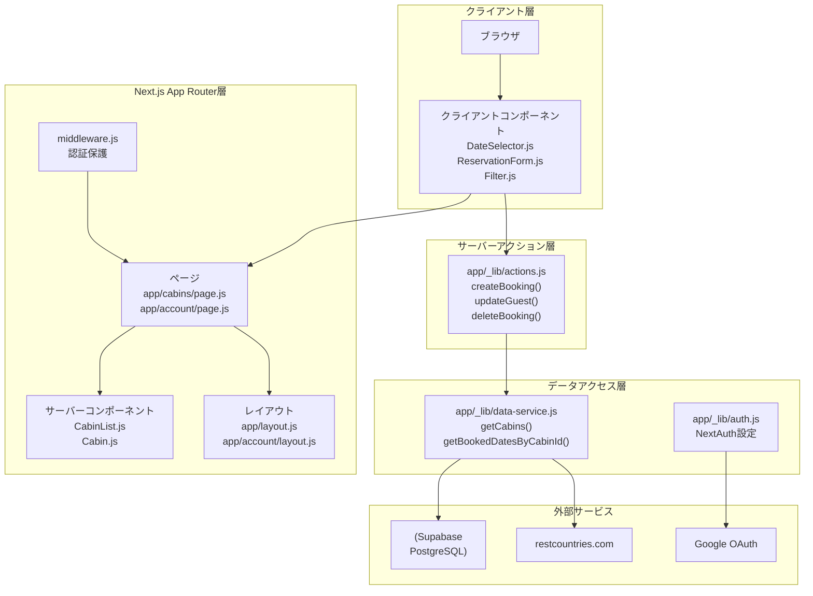
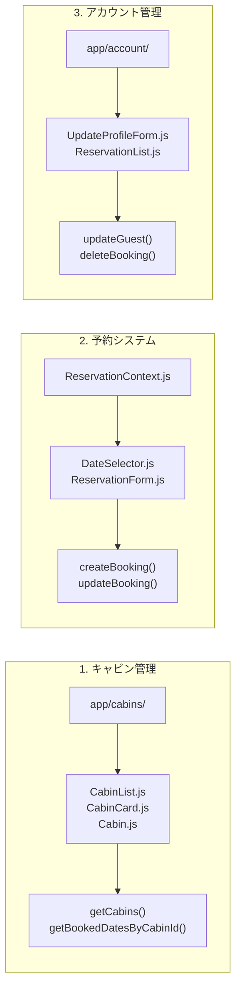
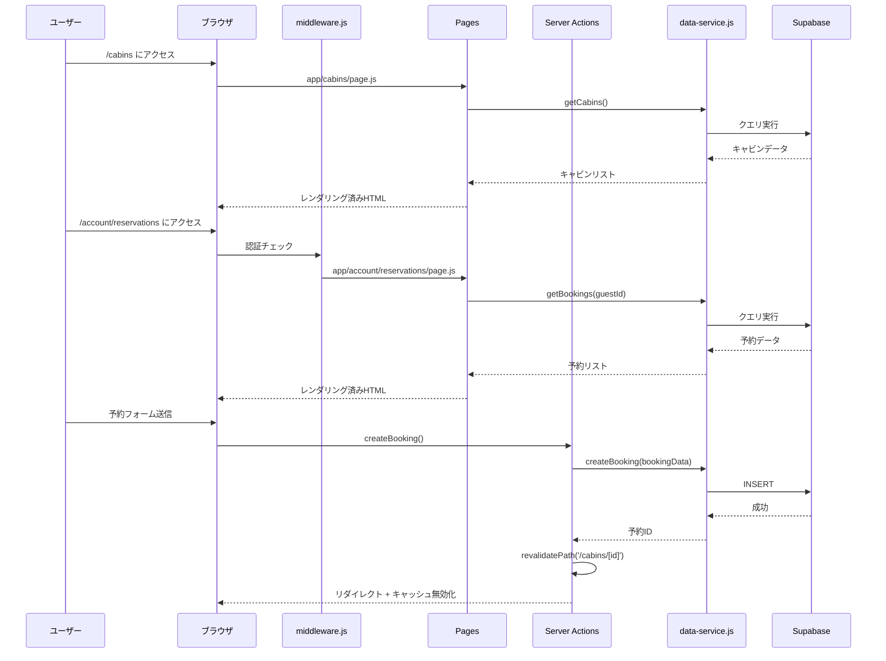
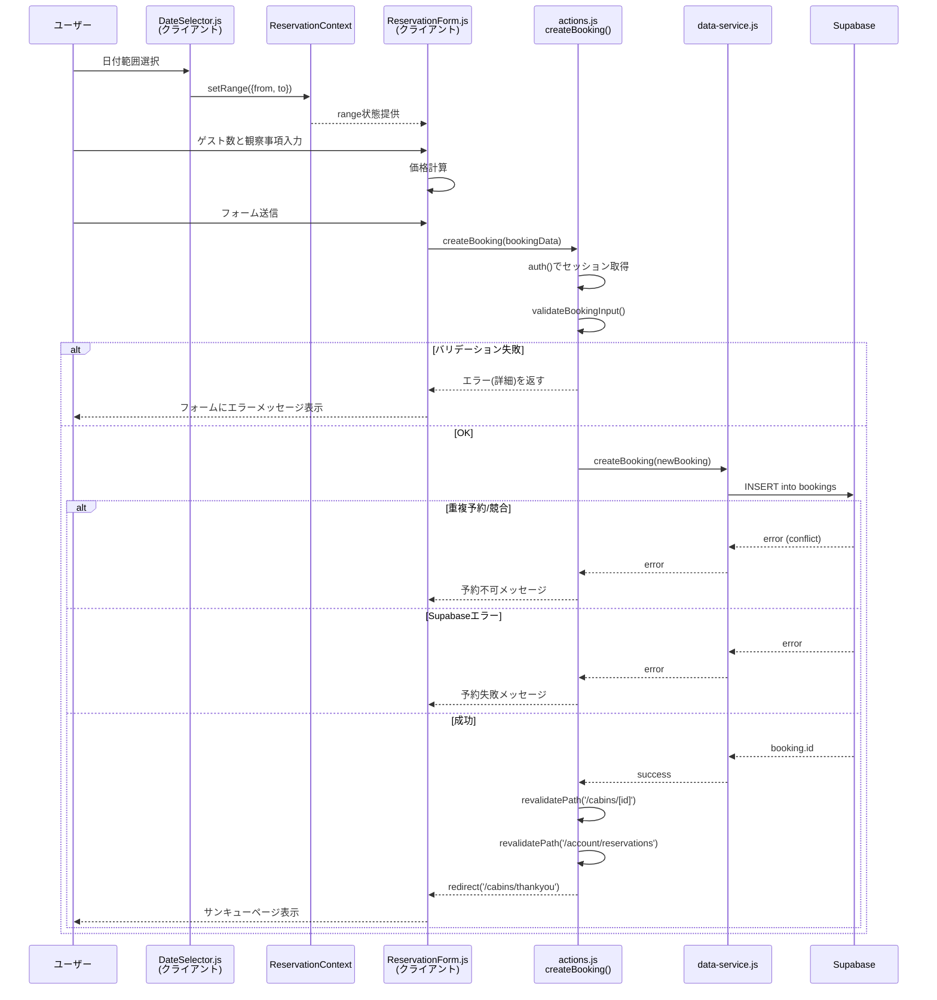
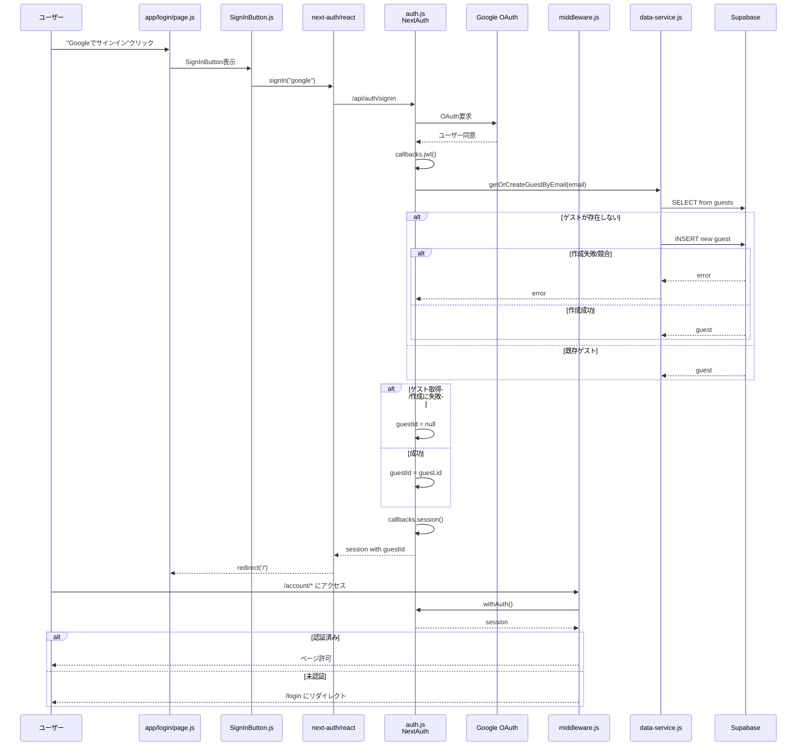

# The Wild Oasis - 概要ドキュメント

[](https://github.com/myoshi2891/MasterModernReact_NextJs/stargazers)
[](https://github.com/myoshi2891/MasterModernReact_NextJs/network/members)

[](https://deepwiki.com/myoshi2891/MasterModernReact_NextJs)

## 目次

- [目的と範囲](#目的と範囲)
- [アプリケーションの目的](#アプリケーションの目的)
- [技術スタック](#技術スタック)
- [アーキテクチャ概要](#アーキテクチャ概要)
- [コア機能システム](#コア機能システム)
- [アプリケーションファイル構造](#アプリケーションファイル構造)
- [主要な設定ファイル](#主要な設定ファイル)
- [統合ポイント](#統合ポイント)
- [データフローアーキテクチャ](#データフローアーキテクチャ)
- [パフォーマンス最適化](#パフォーマンス最適化)
- [開発ワークフロー](#開発ワークフロー)
- [まとめ](#まとめ)

## 目的と範囲

このドキュメントは、Next.jsベースの高級キャビン予約アプリケーション「The Wild Oasis」の概要を提供します。アプリケーションの目的、アーキテクチャ、技術スタック、コア機能システム、および統合ポイントについて説明します。

### 詳細情報のリファレンス

特定のサブシステムの詳細については、以下を参照してください：

- 認証とセッション管理：**Authentication System**
- データアクセスパターンとSupabase統合：**Data Access Layer**
- ミューテーション操作とキャッシュ無効化：**Server Actions**
- キャビンの閲覧とフィルタリング：**Cabin Management System**
- 予約フローと日付選択：**Reservation & Booking System**
- ユーザープロフィールと予約管理：**Account Management**

## アプリケーションの目的

The Wild Oasisは、ゲストが高級キャビンを閲覧し、空室状況を確認し、予約を行い、統合されたアカウントシステムを通じて予約を管理できるキャビンホテル予約システムです。

### 主な機能

- 収容人数ベースのフィルタリングによるキャビン閲覧
- 日付ベースの空室確認と予約機能
- Google OAuthベースのユーザー認証
- 国選択機能付きゲストプロフィール管理
- 予約管理（表示、編集、削除）
- データ永続化のためのSupabase統合

## 技術スタック

このアプリケーションは、パフォーマンスと開発者体験に最適化された最新のWeb開発技術を活用しています。

### コア依存関係

| カテゴリ | 技術 | バージョン | 目的 |
|---------|------|-----------|------|
| フレームワーク | next | 14.2.35 | App Router、Server Components、ISR |
| UIライブラリ | react | ^18 | SSRサポート付きコンポーネントベースUI |
| 認証 | next-auth | 4.24.13 | OAuth統合とセッション管理 |
| データベース | @supabase/supabase-js | ^2.56.0 | リアルタイム機能付きPostgreSQLデータベース |
| スタイリング | tailwindcss | ^3.4.1 | ユーティリティファーストCSSフレームワーク |
| アイコン | @heroicons/react | ^2.1.5 | Reactアイコンライブラリ |
| 日付処理 | date-fns | ^3.6.0 | 日付操作ユーティリティ |
| 日付ピッカー | react-day-picker | ^8.10.1 | カレンダーUIコンポーネント |

### 開発依存関係

| カテゴリ | 技術 | バージョン | 目的 |
|---------|------|-----------|------|
| テスト | @playwright/test | ^1.55.1 | E2Eテスト |
| テスト | @testing-library/react | ^16.3.0 | Reactコンポーネントテスト |
| テスト | vitest | ^3.2.4 | ユニットテストフレームワーク |
| モック | msw | ^2.11.3 | テスト用APIモック |
| リント | eslint-config-next | 14.2.5 | Next.js ESLint設定 |

### Node.js環境

アプリケーションは`engines`設定で指定されている通り、**Node.js バージョン >=20**が必要です（CI は 20/22 を検証）。

## アーキテクチャ概要

The Wild OasisはNext.js 14 App Routerアーキテクチャに従い、サーバーサイドレンダリングと選択的なクライアントサイドインタラクティビティを採用しています。

### システムアーキテクチャとコードエンティティ



## コア機能システム

アプリケーションは3つの主要な機能ドメインに分かれています。各システムは特定のコードモジュールとコンポーネントに直接マッピングされます。

### 機能システムアーキテクチャマッピング



### 1. キャビン管理システム

マルチティアアーキテクチャを通じてキャビンデータの表示と空室確認を処理します：

- **キャビンリストページ**: `app/cabins/page.js`がFilterコンポーネント経由で収容人数フィルタリング付きでサーバーサイドレンダリング
- **キャビン詳細ページ**: `app/cabins/[cabinId]/page.js`が`generateStaticParams()`を使用してビルド時に事前生成
- **空室確認**: `data-service.js`の`getBookedDatesByCabinId()`関数が予約済み日付を計算
- **コンポーネント**: プレゼンテーション層として`CabinList.js`、`CabinCard.js`、`Cabin.js`
- **ISR戦略**: `export const revalidate = 3600`によりキャビンリストが1時間ごとに更新

詳細なドキュメントについては、**Cabin Management System**を参照してください。

### 2. 予約・ブッキングシステム

クライアントとサーバーのインタラクションを伴う完全な予約ワークフローを管理します：

- **日付状態**: `app/_components/ReservationContext.js`のReservationContextがグローバル`{from, to}`状態を提供
- **日付選択UI**: react-day-picker統合の`DateSelector.js`クライアントコンポーネント
- **予約フォーム**: `ReservationForm.js`がゲスト数、観察事項、価格計算を処理
- **ミューテーションロジック**: `app/_lib/actions.js`の`createBooking()`サーバーアクションが予約を検証・永続化
- **キャッシュ無効化**: `revalidatePath()`でUIが最新の予約データを反映することを保証

詳細なドキュメントについては、**Reservation & Booking System**を参照してください。

### 3. アカウント管理

ロールベースのアクセス制御を持つ認証済みユーザー機能を提供します：

- **認証**: `SignInButton.js`/`SignOutButton.js`が`next-auth/react`の`signIn`/`signOut`を呼び出し
- **プロフィール管理**: `app/account/profile/page.js`と`UpdateProfileForm.js`でゲストデータ更新
- **予約リスト**: `app/account/reservations/page.js`が`ReservationList.js`経由でユーザー予約を表示
- **編集/削除**: 認可チェック付きの`updateBooking()`と`deleteBooking()`サーバーアクション
- **ルート保護**: `middleware.js`がすべての`/account/*`ルートに認証を強制

詳細なドキュメントについては、**Account Management**を参照してください。

### 実際のルートを用いたリクエストフロー



## アプリケーションファイル構造

コードベースはNext.js App Routerの規約に従い、機能ベースの組織化を採用しています：

```
the-wild-oasis-website/
├── app/
│   ├── layout.js                    # ReservationProvider付きルートレイアウト
│   ├── page.js                      # ホームページ (/)
│   ├── error.js                     # グローバルエラーバウンダリ
│   ├── not-found.js                 # 404ページ
│   │
│   ├── _components/                 # 共有コンポーネント
│   │   ├── Header.js                # ナビゲーション付きアプリヘッダー
│   │   ├── Navigation.js            # メインナビゲーションメニュー
│   │   ├── ReservationProvider.js   # 予約状態コンテキスト
│   │   ├── Spinner.js               # ローディングスピナー
│   │   └── ...                      # その他の共有コンポーネント
│   │
│   ├── _lib/                        # ライブラリコード
│   │   ├── actions.js               # サーバーアクション
│   │   ├── auth.js                  # NextAuth設定
│   │   ├── data-service.js          # Supabaseデータ層
│   │   └── supabase.js              # Supabaseクライアント設定
│   │
│   ├── cabins/                      # キャビンルート
│   │   ├── page.js                  # キャビンリスト (/cabins)
│   │   ├── [cabinId]/               # 動的キャビン詳細
│   │   │   └── page.js              # 個別キャビンページ
│   │   └── thankyou/                # 予約後の確認
│   │
│   ├── account/                     # アカウントルート (保護済み)
│   │   ├── layout.js                # サイドナビ付きアカウントレイアウト
│   │   ├── page.js                  # アカウントダッシュボード
│   │   ├── profile/                 # プロフィール管理
│   │   │   └── page.js              # プロフィール編集フォーム
│   │   └── reservations/            # 予約管理
│   │       ├── page.js              # 予約リスト
│   │       └── edit/[bookingId]/    # 予約編集
│   │
│   ├── about/                       # Aboutページ
│   │   └── page.js
│   │
│   ├── login/                       # ログインページ
│   │   └── page.js
│   │
│   └── api/                         # APIルート
│       └── auth/[...nextauth]/      # NextAuth APIエンドポイント
│
├── middleware.js                    # ルート保護ミドルウェア
├── public/                          # 静的アセット
├── package.json                     # 依存関係とスクリプト
├── next.config.mjs                  # Next.js設定
├── tailwind.config.js               # Tailwind CSS設定
├── jsconfig.json                    # JavaScriptコンパイラオプション
└── .eslintrc.json                   # ESLint設定
```

## 主要な設定ファイル

### パスエイリアス

`jsconfig.json`で設定されたパスエイリアス：

- `@/*`がプロジェクトルートディレクトリにマッピング
- `import { auth } from "@/app/_lib/auth"`のようなインポートが可能

### ESLint設定

コード品質とパフォーマンスチェックのためにNext.jsコアウェブバイタルルールを拡張しています。

### ルートレイアウト設定

`app/layout.js`ファイルでグローバルアプリケーション設定を定義：

- **タイトルテンプレート**: `%s | The Wild Oasis`で一貫したページタイトル
- **説明**: 高級キャビン市場をターゲットにしたSEOメタデータ
- **フォント**: Google FontsからJosefin Sans
- **プロバイダー**: 予約状態管理のためReservationProviderでアプリケーションをラップ

### NPMスクリプト

開発とデプロイに利用可能なコマンド：

| スクリプト | コマンド | 目的 |
|-----------|---------|------|
| dev | next dev | 開発サーバー起動 |
| build | next build | 本番ビルド作成 |
| start | next start | 本番サーバー実行 |
| lint | next lint | ESLintチェック実行 |
| prod | next build && next start | ビルドと本番起動 |

## 統合ポイント

### 外部サービス統合

アプリケーションは複数の外部サービスと統合しています：

#### Supabaseデータベース

- **クライアント**: `app/_lib/supabase.js`の`createClient()`で作成
- **管理クライアント**: 特権操作用に`createAdminClient()`で作成
- **目的**: キャビン、予約、ゲスト、設定用PostgreSQLデータベース
- **リアルタイム**: ライブデータ更新用のサブスクリプション機能

#### Google OAuth

- **プロバイダー**: NextAuthを通じて`app/_lib/auth.js`で設定
- **目的**: ユーザー認証とプロフィールデータ取得
- **フロー**: `SignInButton.js`/`SignOutButton.js`のクライアント呼び出しで管理

#### NextAuth 4

- **設定**: `app/_lib/auth.js`で定義
- **セッション管理**: ルート保護のため`middleware.js`の`withAuth`ミドルウェア
- **コールバック**: ユーザーとセッション処理用のカスタムコールバック

#### restcountries.com API

- **エンドポイント**: `https://restcountries.com/v3.1/all?fields=name,flags`
- **目的**: プロフィール管理用の国データ取得
- **実装**: `data-service.js`の`getCountries()`関数で呼び出し

### 内部統合パターン

#### ReservationContext

- **ファイル**: `app/_components/ReservationContext.js`
- **目的**: 予約日付範囲のクライアントサイド状態管理
- **使用方法**: ルートレイアウトでラップ、日付セレクターと予約フォームで使用
- **状態**: `range`（開始/終了日）と`resetRange()`関数

#### サーバーアクションのキャッシュ無効化

- **パターン**: ミューテーション後の`revalidatePath()`呼び出し
- **場所**: `app/_lib/actions.js`全体
- **目的**: 更新後にUIが最新データを反映することを保証

## データフローアーキテクチャ

### コードエンティティを用いた予約作成フロー



**エラーハンドリング（予約フロー）**
- バリデーション失敗時はDBアクセスせず、フォームへエラーを返す
- 重複予約はユーザーに予約不可メッセージを返し、サーバーログへ記録
- Supabaseエラー時は失敗メッセージを返し、現時点では自動リトライなし

### コード参照を用いた認証フロー



**エラーハンドリング（認証フロー）**
- ゲスト取得/作成に失敗した場合は `guestId=null` として継続し、サーバーログへ記録
- Supabase側の失敗は自動リトライせず、必要に応じて後続の再試行/再ログインで回復

## パフォーマンス最適化

アプリケーションは複数のNext.js 14パフォーマンス戦略を実装しています：

### レンダリング戦略概要

| 戦略 | 実装 | ファイル | 再検証 |
|------|------|---------|--------|
| SSG | generateStaticParams() | app/cabins/[cabinId]/page.js | ビルド時 |
| ISR | export const revalidate = 3600 | app/cabins/page.js | 3600秒ごと |
| サーバーコンポーネント | デフォルト (no 'use client') | app/内のほとんどの.jsファイル | リクエストごと |
| クライアントコンポーネント | 'use client'ディレクティブ | DateSelector.js, ReservationForm.js, Filter.js | N/A |

### 静的サイト生成（SSG）

キャビン詳細ページはビルド時に事前レンダリング：

```javascript
// app/cabins/[cabinId]/page.js
export async function generateStaticParams() {
  const cabins = await getCabins();
  return cabins.map(cabin => ({ cabinId: String(cabin.id) }));
}
```

- **メリット**: すべてのキャビンページでほぼ瞬時のページロード
- **ビルドプロセス**: `npm run build`中にすべてのキャビンルートが生成

### 増分静的再生成（ISR）

キャビンリストページが定期的に更新：

```javascript
// app/cabins/page.js
export const revalidate = 3600; // 1時間ごとに再検証
```

- **メリット**: 3600秒ごとに新鮮なデータで静的パフォーマンス
- **戦略**: TTL期限後のバックグラウンド再生成

### デフォルトのサーバーコンポーネント

すべてのコンポーネントは明示的にクライアントコンポーネントとしてマークされない限りサーバーサイドレンダリング：

- **サーバーコンポーネント**: CabinList.js、CabinCard.js、Cabin.js、ReservationList.js
- **クライアントコンポーネント**: DateSelector.js、ReservationForm.js、DeleteReservation.js、Filter.js
- **メリット**: JavaScriptバンドルサイズの削減、Time to Interactive（TTI）の改善

### 画像最適化

Next.js Imageコンポーネントが自動最適化を提供：

- **コンポーネント**: アプリケーション全体で`next/image`を使用
- **機能**: 自動WebP変換、レイジーローディング、レスポンシブサイジング
- **メリット**: 帯域幅使用量の削減とLargest Contentful Paint（LCP）の改善

## 開発ワークフロー

### 利用可能なコマンド

```bash
# ホットリロード付き開発サーバー
npm run dev

# 本番ビルド作成
npm run build

# 本番サーバー実行
npm start

# リントチェック実行
npm run lint

# ビルドと本番起動（組み合わせ）
npm run prod
```

### 環境要件

- **Node.js**: >=20 (CI: 20/22)
- 必要な環境変数（**Project Setup & Configuration**を参照）

### Project Setup & Configuration

#### 環境変数

`.env.example` をコピーして `.env` を作成し、値を設定します（`.env` はコミットしない）。

```bash
# Supabase (browser/client)
NEXT_PUBLIC_SUPABASE_URL=
NEXT_PUBLIC_SUPABASE_KEY=

# Supabase (server)
SUPABASE_URL=
SUPABASE_SERVICE_ROLE_KEY=

# NextAuth (Google OAuth)
AUTH_GOOGLE_ID=
AUTH_GOOGLE_SECRET=
NEXTAUTH_URL=http://localhost:3000
NEXTAUTH_SECRET=

# Optional
PLAYWRIGHT_BASE_URL=http://127.0.0.1:3000
TZ=Asia/Tokyo
```

取得元の目安:
- Supabase: Project Settings → API から URL と keys を取得
- Google OAuth: Google Cloud Console で OAuth クライアントを作成

## まとめ

The Wild Oasisは、包括的なキャビン予約体験を提供する最新のNext.js 14アプリケーションです。主要なアーキテクチャの決定事項：

- **Next.js App Router**: 最適なパフォーマンスのためにサーバーコンポーネントを活用
- **Supabase統合**: リアルタイム機能付きPostgreSQLデータベース
- **NextAuth 4**: Google OAuthによる安全な認証
- **サーバーアクション**: 自動キャッシュ無効化を伴う型安全なミューテーション
- **Context API**: 予約フローのクライアントサイド状態管理
- **Tailwind CSS**: 迅速な開発のためのユーティリティファーストスタイリング

アプリケーションは、関心の明確な分離とサービス指向のデータアクセス層を持つ3つのコア機能システム（キャビン管理、予約システム、アカウント管理）に組織化されています。

<div align="center">

**⭐ このプロジェクトが役立ちましたら、ぜひスターを付けてください！**

[](https://github.com/myoshi2891)

</div>
