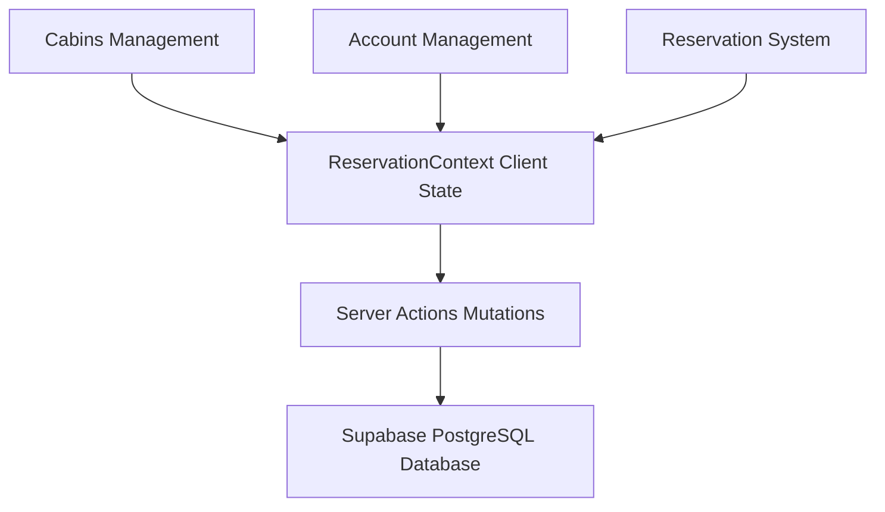
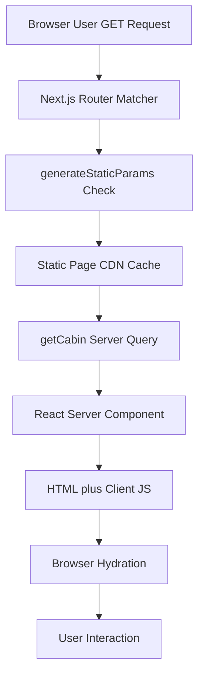
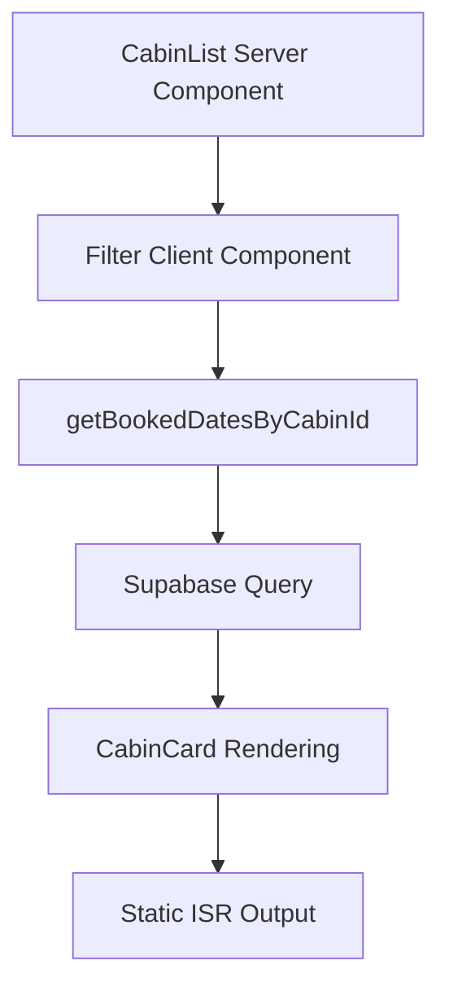
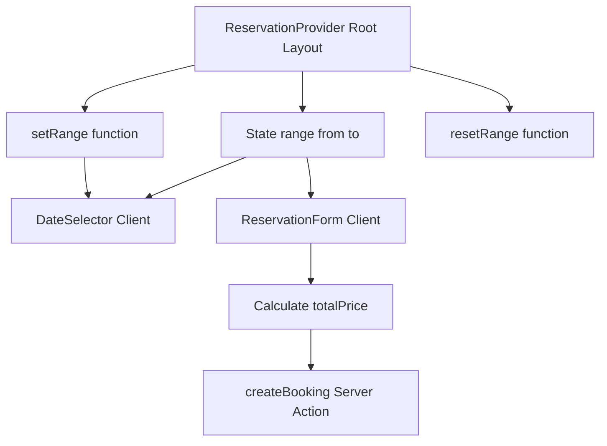
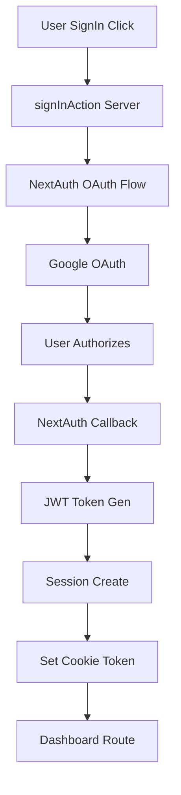
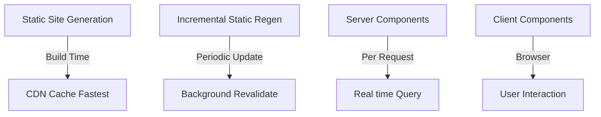
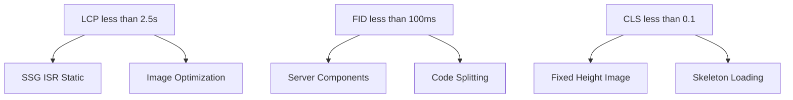
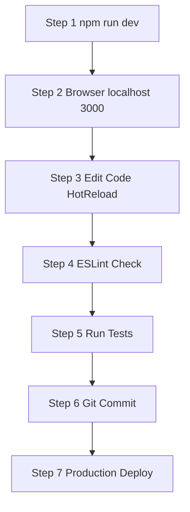
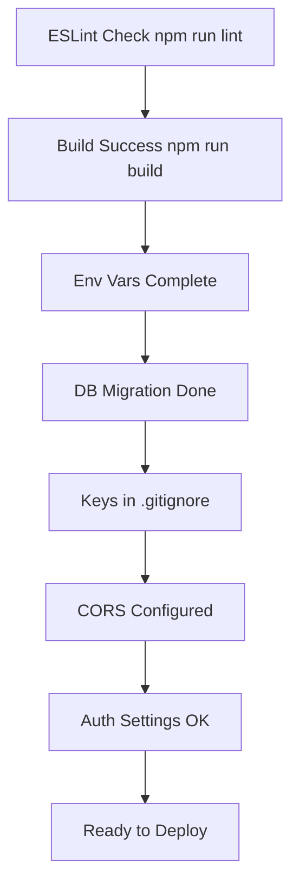
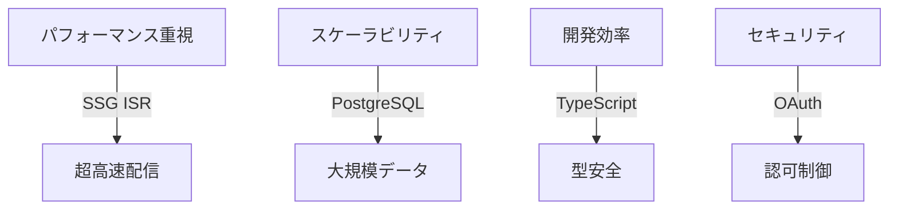

# 🏕️ The Wild Oasis - アーキテクチャドキュメント

[](https://deepwiki.com/myoshi2891/MasterModernReact_NextJs)

## 📋 目次

- [概要](#概要)
- [技術スタック](#技術スタック)
- [アーキテクチャ構成](#アーキテクチャ構成)
- [コア機能システム](#コア機能システム)
- [ファイル構造](#ファイル構造)
- [統合ポイント](#統合ポイント)
- [パフォーマンス最適化](#パフォーマンス最適化)
- [開発ワークフロー](#開発ワークフロー)
- [実装パターン集](#実装パターン集)
- [セキュリティ](#セキュリティ)
- [テスト](#テスト)
- [デプロイメント](#デプロイメント)

---

## 概要

### 🎯 アプリケーション目的

**The Wild Oasis** は、Next.js ベースのラグジュアリーキャビン予約システムです。ゲストが高級キャビンを閲覧し、空室確認、予約、予約管理を統合インターフェースで実施できます。

#### 🌟 主要機能

| 機能             | 説明                           |
| ---------------- | ------------------------------ |
| キャビン閲覧     | 容量ベースのフィルタリング対応 |
| 空室確認         | 日付ベースの予約チェック       |
| 予約システム     | 直感的な日付選択 UI            |
| Google OAuth     | ソーシャルログイン統合         |
| プロフィール管理 | 国選択などのゲスト情報管理     |
| 予約管理         | 閲覧・編集・削除機能           |
| データ永続化     | Supabase PostgreSQL            |

---

## 技術スタック

### 📦 コア依存関係

| カテゴリ       | 技術                  | バージョン     | 目的                               |
| -------------- | --------------------- | -------------- | ---------------------------------- |
| フレームワーク | Next.js               | 14.2.32        | App Router、Server Components、ISR |
| UI ライブラリ  | React                 | ^18            | コンポーネントベース UI、SSR 対応  |
| 認証           | next-auth             | ^5.0.0-beta.23 | OAuth 統合、セッション管理         |
| データベース   | @supabase/supabase-js | ^2.56.0        | PostgreSQL、リアルタイム機能       |
| スタイリング   | Tailwind CSS          | ^3.4.1         | ユーティリティファースト CSS       |
| アイコン       | @heroicons/react      | ^2.1.5         | React 用アイコンライブラリ         |
| 日付処理       | date-fns              | ^3.6.0         | 日付操作ユーティリティ             |
| 日付ピッカー   | react-day-picker      | ^8.10.1        | カレンダー UI コンポーネント       |

### 🧪 開発用依存関係

| カテゴリ             | 技術                   | バージョン | 目的                           |
| -------------------- | ---------------------- | ---------- | ------------------------------ |
| E2E テスト           | @playwright/test       | ^1.55.1    | ブラウザ統合テスト             |
| コンポーネントテスト | @testing-library/react | ^16.3.0    | React コンポーネント単体テスト |
| ユニットテスト       | vitest                 | ^3.2.4     | ユニットテスト用フレームワーク |
| API モック           | msw                    | ^2.11.3    | テスト用 API モッキング        |
| Lint 設定            | eslint-config-next     | 14.2.5     | Next.js ESLint 設定            |

### 🔧 環境要件

```bash
Node.js: >=20.19.0 <21
npm: 10.x以上推奨
```

---

## アーキテクチャ構成

### 🏗️ システムアーキテクチャ図



### 🔄 完全なリクエスト-レスポンスフロー



---

## コア機能システム

### 1️⃣ キャビン管理システム

#### 📍 責務

キャビンデータの表示と空室確認を多層アーキテクチャで管理します。

#### 📊 処理パイプライン



#### 🔗 主要コンポーネント

```javascript
// app/cabins/page.js - キャビン一覧（Server Component）
export const revalidate = 3600;

export default async function CabinsPage({ searchParams }) {
  const capacity = searchParams?.capacity;
  let cabins = await getCabins();

  if (capacity) {
    cabins = cabins.filter(c => c.maxCapacity >= Number(capacity));
  }

  return (
    <div className="grid gap-8">
      {cabins.map(cabin => (
        <CabinCard key={cabin.id} cabin={cabin} />
      ))}
    </div>
  );
}

// app/cabins/[cabinId]/page.js
export async function generateStaticParams() {
  const cabins = await getCabins();
  return cabins.map(cabin => ({ cabinId: String(cabin.id) }));
}

export default async function CabinPage({ params }) {
  const cabin = await getCabin(params.cabinId);
  const reservations = await getReservations(params.cabinId);

  return (
    <>
      <Cabin cabin={cabin} />
      <ReservationForm cabin={cabin} reservations={reservations} />
    </>
  );
}
```

#### ⚙️ 主要関数

| 関数                    | ファイル          | 説明                | 戻り値      |
| ----------------------- | ----------------- | ------------------- | ----------- |
| getCabins               | data-service.js   | 全キャビン取得      | Cabin[]     |
| getCabin                | data-service.js   | ID 指定キャビン取得 | Cabin       |
| getBookedDatesByCabinId | data-service.js   | 予約済み日付取得    | Date[]      |
| generateStaticParams    | [cabinId]/page.js | ビルド時静的生成    | {cabinId}[] |

---

### 2️⃣ 予約・ブッキングシステム

#### 📍 責務

日付選択から確認までの予約フローを管理し、クライアント・サーバー間の状態同期を実現します。

#### 🔄 状態フロー図



#### 🔗 コンポーネント構成

```javascript
// app/_components/ReservationContext.js
'use client';

import { createContext, useState } from 'react';

export const ReservationContext = createContext();

export function ReservationProvider({ children }) {
  const [range, setRange] = useState({ from: null, to: null });

  const resetRange = () => {
    setRange({ from: null, to: null });
  };

  return (
    <ReservationContext.Provider value={{ range, setRange, resetRange }}>
      {children}
    </ReservationContext.Provider>
  );
}

// app/_components/DateSelector.js
'use client';

import { DayPicker } from 'react-day-picker';
import { useContext } from 'react';
import { ReservationContext } from './ReservationContext';

export default function DateSelector({ cabin, bookedDates }) {
  const { range, setRange } = useContext(ReservationContext);
  const disabled = bookedDates.map(date => new Date(date));

  return (
    <DayPicker
      mode="range"
      selected={range}
      onSelect={setRange}
      disabled={disabled}
      min={2}
      max={180}
    />
  );
}

// app/_components/ReservationForm.js
'use client';

import { useContext, useState } from 'react';
import { ReservationContext } from './ReservationContext';
import { createBooking } from '@/app/_lib/actions';

export default function ReservationForm({ cabin, reservations }) {
  const { range } = useContext(ReservationContext);
  const [numGuests, setNumGuests] = useState(cabin.maxCapacity);
  const [observations, setObservations] = useState('');

  const nights = range?.from && range?.to
    ? Math.floor((range.to - range.from) / (1000 * 60 * 60 * 24))
    : 0;
  const totalPrice = nights * cabin.regularPrice;

  const handleSubmit = async (e) => {
    e.preventDefault();

    try {
      await createBooking({
        cabinId: cabin.id,
        startDate: range.from,
        endDate: range.to,
        numGuests,
        observations,
        totalPrice,
      });
    } catch (error) {
      console.error('予約エラー:', error);
    }
  };

  return (
    <form onSubmit={handleSubmit} className="bg-white p-6 rounded-lg">
      <div className="mb-4">
        <label>ゲスト数: {numGuests}</label>
        <input
          type="range"
          min={1}
          max={cabin.maxCapacity}
          value={numGuests}
          onChange={(e) => setNumGuests(Number(e.target.value))}
        />
      </div>

      <div className="mb-4">
        <label>備考</label>
        <textarea
          value={observations}
          onChange={(e) => setObservations(e.target.value)}
          placeholder="特別なリクエストがあれば記入してください"
        />
      </div>

      <div className="text-2xl font-bold mb-4">
        ¥{totalPrice.toLocaleString()}
      </div>

      <button
        type="submit"
        disabled={!range?.from || !range?.to}
        className="w-full bg-blue-600 text-white py-2 rounded"
      >
        予約確定
      </button>
    </form>
  );
}
```

#### 🚀 Server Action: createBooking()

```javascript
"use server";

import { revalidatePath } from "next/cache";
import { redirect } from "next/navigation";
import { auth } from "./auth";
import { supabaseAdmin } from "./supabase";

export async function createBooking(bookingData) {
  const session = await auth();
  if (!session) throw new Error("認証が必要です");

  if (!bookingData.cabinId || !bookingData.startDate || !bookingData.endDate) {
    throw new Error("必須フィールドが不足しています");
  }

  if (new Date(bookingData.startDate) >= new Date(bookingData.endDate)) {
    throw new Error("終了日は開始日より後である必要があります");
  }

  const { data: conflicts } = await supabaseAdmin
    .from("bookings")
    .select("id")
    .eq("cabinId", bookingData.cabinId)
    .or(
      `and(startDate.lte.${bookingData.endDate},` +
        `endDate.gte.${bookingData.startDate})`
    );

  if (conflicts && conflicts.length > 0) {
    throw new Error("この期間は既に予約されています");
  }

  const { error: insertError } = await supabaseAdmin.from("bookings").insert([
    {
      cabinId: bookingData.cabinId,
      guestId: session.user.id,
      startDate: bookingData.startDate,
      endDate: bookingData.endDate,
      numGuests: bookingData.numGuests,
      observations: bookingData.observations,
      totalPrice: bookingData.totalPrice,
      status: "confirmed",
      createdAt: new Date().toISOString(),
    },
  ]);

  if (insertError) throw new Error("予約の作成に失敗しました");

  revalidatePath(`/cabins/${bookingData.cabinId}`);
  revalidatePath("/account/reservations");

  redirect(`/cabins/${bookingData.cabinId}/thankyou`);
}
```

---

### 3️⃣ アカウント管理システム

#### 📍 責務

認証ユーザー機能を提供し、ロールベースのアクセス制御を実装します。

#### 🔐 認証フロー



#### 🔧 実装コード

```javascript
// app/_lib/auth.js
import NextAuth from "next-auth";
import GoogleProvider from "next-auth/providers/google";

export const authConfig = {
  providers: [
    GoogleProvider({
      clientId: process.env.AUTH_GOOGLE_ID,
      clientSecret: process.env.AUTH_GOOGLE_SECRET,
      allowDangerousEmailAccountLinking: true,
    }),
  ],
  pages: {
    signIn: "/login",
  },
  callbacks: {
    async jwt({ token, user }) {
      if (user) token.id = user.id;
      return token;
    },

    async session({ session, token }) {
      session.user.id = token.id;
      return session;
    },

    authorized({ auth }) {
      return !!auth?.user;
    },
  },
};

export const { auth, signIn, signOut, handlers } = NextAuth(authConfig);
```

#### 🛡️ ルート保護

```javascript
// middleware.js
import { auth } from "@/app/_lib/auth";

export const middleware = auth((request) => {
  const { pathname } = request.nextUrl;

  if (pathname.startsWith("/account")) {
    if (!request.auth) {
      const newUrl = new URL("/login", request.url);
      return Response.redirect(newUrl);
    }
  }

  return Response.next();
});

export const config = {
  matcher: ["/account/:path*"],
};
```

#### 👤 プロフィール管理

```javascript
// app/account/profile/page.js
import { auth } from "@/app/_lib/auth";
import { getGuest } from "@/app/_lib/data-service";
import UpdateProfileForm from "@/app/_components/UpdateProfileForm";

export default async function ProfilePage() {
  const session = await auth();
  if (!session?.user) redirect("/login");

  const guest = await getGuest(session.user.id);

  return (
    <div className="max-w-2xl">
      <h2 className="text-2xl font-bold mb-6">プロフィール管理</h2>
      <UpdateProfileForm guest={guest} />
    </div>
  );
}

// Server Action
("use server");

export async function updateGuest(formData) {
  const session = await auth();
  if (!session?.user) throw new Error("認証が必要です");

  const { error } = await supabaseAdmin
    .from("guests")
    .update({
      fullName: formData.fullName,
      email: formData.email,
      country: formData.country,
      updatedAt: new Date().toISOString(),
    })
    .eq("id", session.user.id);

  if (error) throw new Error("更新に失敗しました");

  revalidatePath("/account/profile");
}
```

#### 📋 予約管理

```javascript
// app/account/reservations/page.js
import { auth } from "@/app/_lib/auth";
import { getReservations } from "@/app/_lib/data-service";
import ReservationList from "@/app/_components/ReservationList";

export default async function ReservationsPage() {
  const session = await auth();
  if (!session?.user) redirect("/login");

  const reservations = await getReservations(session.user.id);

  return (
    <div className="space-y-6">
      <h2 className="text-3xl font-bold">予約履歴</h2>
      {reservations.length === 0 ? (
        <p className="text-gray-500">予約がありません</p>
      ) : (
        <ReservationList reservations={reservations} userId={session.user.id} />
      )}
    </div>
  );
}

// Server Actions
("use server");

export async function updateBooking(bookingId, updates) {
  const session = await auth();
  if (!session?.user) throw new Error("認証が必要です");

  const { data: booking } = await supabaseAdmin
    .from("bookings")
    .select("guestId")
    .eq("id", bookingId)
    .single();

  if (booking.guestId !== session.user.id) {
    throw new Error("権限がありません");
  }

  await supabaseAdmin
    .from("bookings")
    .update({ ...updates, updatedAt: new Date().toISOString() })
    .eq("id", bookingId);

  revalidatePath("/account/reservations");
}

export async function deleteBooking(bookingId) {
  const session = await auth();
  if (!session?.user) throw new Error("認証が必要です");

  const { data: booking } = await supabaseAdmin
    .from("bookings")
    .select("guestId, startDate")
    .eq("id", bookingId)
    .single();

  if (booking.guestId !== session.user.id) {
    throw new Error("権限がありません");
  }

  if (new Date(booking.startDate) < new Date()) {
    throw new Error("チェックイン前の予約のみ削除できます");
  }

  await supabaseAdmin.from("bookings").delete().eq("id", bookingId);

  revalidatePath("/account/reservations");
}
```

---

## ファイル構造

### 📂 プロジェクトレイアウト

```
the-wild-oasis-website/
├── app/
│   ├── layout.js
│   ├── page.js
│   ├── error.js
│   ├── not-found.js
│   ├── _components/
│   │   ├── Header.js
│   │   ├── Navigation.js
│   │   ├── ReservationProvider.js
│   │   ├── ReservationContext.js
│   │   ├── DateSelector.js
│   │   ├── ReservationForm.js
│   │   ├── Filter.js
│   │   └── Spinner.js
│   ├── _lib/
│   │   ├── actions.js
│   │   ├── auth.js
│   │   ├── data-service.js
│   │   └── supabase.js
│   ├── cabins/
│   │   ├── page.js
│   │   ├── [cabinId]/
│   │   │   └── page.js
│   │   └── thankyou/
│   │       └── page.js
│   ├── account/
│   │   ├── layout.js
│   │   ├── page.js
│   │   ├── profile/
│   │   │   └── page.js
│   │   └── reservations/
│   │       ├── page.js
│   │       └── edit/[bookingId]/
│   │           └── page.js
│   ├── about/
│   │   └── page.js
│   ├── login/
│   │   └── page.js
│   └── api/
│       └── auth/[...nextauth]/
│           └── route.js
├── middleware.js
├── public/
├── package.json
├── next.config.js
├── tailwind.config.js
├── jsconfig.json
└── .eslintrc.json
```

### 🔗 パスエイリアス設定

```javascript
// jsconfig.json
{
  "compilerOptions": {
    "baseUrl": ".",
    "paths": {
      "@/*": ["./*"]
    },
    "target": "ES2020",
    "lib": ["ES2020", "DOM", "DOM.Iterable"]
  },
  "include": ["**/*.js", "**/*.jsx"],
  "exclude": ["node_modules"]
}
```

**利点:**

```javascript
// ✅ Good - 相対パス不要
import { auth } from "@/app/_lib/auth";
import { CabinCard } from "@/app/_components/CabinCard";

// ❌ Avoid - 相対パスの煩雑さ
import { auth } from "../../app/_lib/auth";
import { CabinCard } from "../../../_components/CabinCard";
```

---

## 統合ポイント

### 🌐 外部サービス統合

#### **1. Supabase PostgreSQL**

```javascript
// app/_lib/supabase.js
import { createClient } from "@supabase/supabase-js";

export const supabase = createClient(
  process.env.NEXT_PUBLIC_SUPABASE_URL,
  process.env.NEXT_PUBLIC_SUPABASE_ANON_KEY
);

export function createAdminClient() {
  return createClient(
    process.env.SUPABASE_URL,
    process.env.SUPABASE_SERVICE_ROLE_KEY
  );
}

export const supabaseAdmin = createAdminClient();
```

**データベーススキーマ:**

```sql
CREATE TABLE cabins (
  id BIGINT PRIMARY KEY,
  name TEXT NOT NULL,
  maxCapacity INT NOT NULL,
  regularPrice INT NOT NULL,
  discount INT,
  description TEXT,
  image TEXT,
  created_at TIMESTAMP DEFAULT CURRENT_TIMESTAMP
);

CREATE TABLE bookings (
  id BIGINT PRIMARY KEY,
  cabinId BIGINT REFERENCES cabins(id),
  guestId UUID REFERENCES guests(id),
  startDate DATE NOT NULL,
  endDate DATE NOT NULL,
  numGuests INT NOT NULL,
  totalPrice INT NOT NULL,
  status TEXT DEFAULT 'confirmed',
  observations TEXT,
  created_at TIMESTAMP DEFAULT CURRENT_TIMESTAMP
);

CREATE TABLE guests (
  id UUID PRIMARY KEY DEFAULT gen_random_uuid(),
  email TEXT UNIQUE NOT NULL,
  fullName TEXT NOT NULL,
  country TEXT,
  created_at TIMESTAMP DEFAULT CURRENT_TIMESTAMP
);
```

#### **2. Google OAuth**

```javascript
// app/_lib/auth.js
import GoogleProvider from "next-auth/providers/google";

export const authConfig = {
  providers: [
    GoogleProvider({
      clientId: process.env.AUTH_GOOGLE_ID,
      clientSecret: process.env.AUTH_GOOGLE_SECRET,
    }),
  ],
};

// 環境変数
// AUTH_GOOGLE_ID=your_client_id.apps.googleusercontent.com
// AUTH_GOOGLE_SECRET=your_secret
// AUTH_SECRET=$(openssl rand -base64 32)
```

#### **3. RestCountries API**

```javascript
// app/_lib/data-service.js
export async function getCountries() {
  try {
    const res = await fetch("https://restcountries.com/v3.1/all", {
      next: { revalidate: 604800, tags: ["countries"] },
    });

    const data = await res.json();

    return data
      .map((country) => ({
        code: country.cca2,
        name: country.name.common,
      }))
      .sort((a, b) => a.name.localeCompare(b.name));
  } catch (error) {
    console.error("API Error:", error);
    return [];
  }
}
```

---

## パフォーマンス最適化

### ⚡ レンダリング戦略比較



#### **SSG - ビルド時生成**

```javascript
export async function generateStaticParams() {
  const cabins = await getCabins();
  return cabins.map((cabin) => ({ cabinId: String(cabin.id) }));
}

export default async function CabinPage({ params }) {
  const cabin = await getCabin(params.cabinId);
  return <CabinDetail cabin={cabin} />;
}
```

| 特性           | 説明                   |
| -------------- | ---------------------- |
| 生成タイミング | npm run build 時       |
| ページロード   | 🚀 最速 CDN キャッシュ |
| データ更新     | 再ビルドが必要         |
| 用途           | 変更頻度が低いページ   |

#### **ISR - 定期更新**

```javascript
export const revalidate = 3600;

export default async function CabinsPage() {
  const cabins = await getCabins();
  return <CabinList cabins={cabins} />;
}
```

| 特性           | 説明                     |
| -------------- | ------------------------ |
| 生成タイミング | ビルド時 + 定期更新      |
| ページロード   | ✈️ 高速 キャッシュ       |
| データ更新     | 自動 バックグラウンド    |
| 用途           | 定期的に更新されるデータ |

#### **Server Components - リクエスト毎**

```javascript
export default async function CabinList() {
  const cabins = await getCabins();
  return (
    <div>
      {cabins.map((c) => (
        <CabinCard key={c.id} cabin={c} />
      ))}
    </div>
  );
}
```

| 特性           | 説明                 |
| -------------- | -------------------- |
| 生成タイミング | リクエスト毎         |
| ページロード   | 👍 普通              |
| データ更新     | リアルタイム         |
| 用途           | 常に最新データが必要 |

#### **Client Components - ブラウザ側**

```javascript
"use client";

import { useContext } from "react";
import { ReservationContext } from "./ReservationContext";

export default function DateSelector({ cabin }) {
  const { range, setRange } = useContext(ReservationContext);
  return <DayPicker selected={range} onSelect={setRange} />;
}
```

| 特性           | 説明                 |
| -------------- | -------------------- |
| 生成タイミング | ブラウザ側で実行     |
| ページロード   | ⏳ 可変              |
| データ更新     | ユーザー操作時       |
| 用途           | インタラクション必須 |

### 📊 Core Web Vitals 最適化



### 🖼️ 画像最適化

```javascript
import Image from "next/image";

export default function CabinCard({ cabin }) {
  return (
    <Image
      src={cabin.image}
      alt={cabin.name}
      fill
      sizes="(max-width: 768px) 100vw, 50vw"
      className="object-cover"
      priority={false}
      quality={80}
      placeholder="blur"
    />
  );
}
```

| 最適化項目             | 効果                |
| ---------------------- | ------------------- |
| 自動 WebP 変換         | -30% ファイルサイズ |
| レスポンシブサイジング | モバイル最適化      |
| Lazy Loading           | 初期ロード削減      |
| blur placeholder       | CLS 削減            |

---

## 開発ワークフロー

### 🚀 利用可能なコマンド

```bash
npm run dev
npm run build
npm start
npm run lint
npm run prod
```

| コマンド      | 説明                        |
| ------------- | --------------------------- |
| npm run dev   | 開発サーバー ホットリロード |
| npm run build | 本番ビルド .next 生成       |
| npm start     | 本番サーバー起動            |
| npm run lint  | ESLint チェック実行         |
| npm run prod  | ビルド と 起動 一括実行     |

### 📝 開発フロー例



---

## 実装パターン集

### 📌 パターン 1: Server Action 標準形

```javascript
"use server";

import { revalidatePath } from "next/cache";
import { redirect } from "next/navigation";
import { auth } from "./auth";

export async function myServerAction(formData) {
  // Step 1: 認証チェック
  const session = await auth();
  if (!session) throw new Error("認証が必要です");

  // Step 2: バリデーション
  if (!formData.title || formData.title.trim() === "") {
    throw new Error("タイトルは必須です");
  }

  // Step 3: 認可チェック
  // ユーザーが権限を持つか確認

  // Step 4: データ操作
  const result = await database.insert(formData);

  // Step 5: キャッシュ無効化
  revalidatePath("/path");

  // Step 6: リダイレクト
  redirect("/success");
}
```

### 📌 パターン 2: Client Component での非同期処理

```javascript
"use client";

import { useTransition } from "react";
import { updateItem } from "@/app/_lib/actions";

export function ItemUpdateForm({ item }) {
  const [isPending, startTransition] = useTransition();

  const handleUpdate = (e) => {
    e.preventDefault();

    startTransition(async () => {
      try {
        const formData = new FormData(e.currentTarget);
        await updateItem(item.id, Object.fromEntries(formData));
      } catch (error) {
        console.error("Error:", error);
      }
    });
  };

  return (
    <form onSubmit={handleUpdate}>
      <input type="text" name="title" defaultValue={item.title} />
      <button type="submit" disabled={isPending}>
        {isPending ? "Updating..." : "Update"}
      </button>
    </form>
  );
}
```

### 📌 パターン 3: Error Boundary

```javascript
// app/error.js
"use client";

export default function Error({ error, reset }) {
  return (
    <div className="min-h-screen flex items-center justify-center bg-gray-50">
      <div className="bg-white p-8 rounded-lg shadow">
        <h2 className="text-2xl font-bold text-red-600 mb-4">
          エラーが発生しました
        </h2>
        <p className="text-gray-600 mb-6">{error.message}</p>
        <button
          onClick={reset}
          className="px-4 py-2 bg-blue-600 text-white rounded hover:bg-blue-700"
        >
          もう一度試す
        </button>
      </div>
    </div>
  );
}
```

### 📌 パターン 4: Dynamic Imports Code Splitting

```javascript
import dynamic from "next/dynamic";
import Spinner from "./Spinner";

const InteractiveMap = dynamic(() => import("./InteractiveMap"), {
  loading: () => <Spinner />,
  ssr: false,
});

export default function CabinDetail({ cabin }) {
  return (
    <div>
      <h1>{cabin.name}</h1>
      <InteractiveMap location={cabin.location} />
    </div>
  );
}
```

### 📌 パターン 5: Streaming with Suspense

```javascript
import { Suspense } from "react";
import CabinSkeleton from "@/app/_components/CabinSkeleton";

async function CabinContent({ cabinId }) {
  const cabin = await getCabin(cabinId);
  return <CabinDetail cabin={cabin} />;
}

async function BookingContent({ cabinId }) {
  const bookings = await getBookings(cabinId);
  return <BookingList bookings={bookings} />;
}

export default function CabinPage({ params }) {
  return (
    <div>
      <Suspense fallback={<CabinSkeleton />}>
        <CabinContent cabinId={params.cabinId} />
      </Suspense>

      <Suspense fallback={<div>Loading bookings...</div>}>
        <BookingContent cabinId={params.cabinId} />
      </Suspense>
    </div>
  );
}
```

### 📌 パターン 6: Form Validation

```javascript
"use client";

import { useActionState } from "react";
import { createBooking } from "@/app/_lib/actions";

export function BookingForm({ cabin }) {
  const [state, formAction, isPending] = useActionState(createBooking, {
    message: "",
    errors: {},
  });

  return (
    <form action={formAction} className="space-y-4">
      <div>
        <label>ゲスト数</label>
        <input
          type="number"
          name="numGuests"
          min={1}
          max={cabin.maxCapacity}
          aria-invalid={!!state.errors.numGuests}
        />
        {state.errors.numGuests && (
          <p className="text-red-600 text-sm">{state.errors.numGuests}</p>
        )}
      </div>

      <button type="submit" disabled={isPending}>
        {isPending ? "Processing..." : "Book Now"}
      </button>

      {state.message && <p className="text-green-600">{state.message}</p>}
    </form>
  );
}
```

---

## セキュリティ

### 🔐 認可チェック テンプレート

```javascript
"use server";

import { auth } from "./auth";
import { supabaseAdmin } from "./supabase";

async function checkAuthorization(userId, resourceId) {
  const { data: resource } = await supabaseAdmin
    .from("bookings")
    .select("guestId")
    .eq("id", resourceId)
    .single();

  if (!resource || resource.guestId !== userId) {
    throw new Error("Permission denied");
  }

  return resource;
}

export async function deleteBooking(bookingId) {
  const session = await auth();
  if (!session?.user) throw new Error("Authentication required");

  await checkAuthorization(session.user.id, bookingId);

  const { data: booking } = await supabaseAdmin
    .from("bookings")
    .select("startDate, status")
    .eq("id", bookingId)
    .single();

  if (booking.status === "cancelled") {
    throw new Error("Already cancelled");
  }

  if (new Date(booking.startDate) < new Date()) {
    throw new Error("Cannot delete past bookings");
  }

  await supabaseAdmin
    .from("bookings")
    .update({ status: "cancelled" })
    .eq("id", bookingId);

  revalidatePath("/account/reservations");
}
```

### 🛡️ SQL インジェクション防止

```javascript
// ✅ Correct - Supabase auto escaping
export async function getBookingsByDateRange(startDate, endDate) {
  const { data } = await supabase
    .from("bookings")
    .select("*")
    .gte("startDate", startDate)
    .lte("endDate", endDate);

  return data;
}

// ❌ Wrong - String concatenation risk
export async function getBookingsDangerous(startDate, endDate) {
  const query = `
    SELECT * FROM bookings
    WHERE startDate >= '${startDate}'
    AND endDate <= '${endDate}'
  `;
}
```

### 🔑 API キー管理

```bash
## .env.local
NEXT_PUBLIC_SUPABASE_URL=https://...
NEXT_PUBLIC_SUPABASE_ANON_KEY=eyJ... (public)
SUPABASE_URL=https://...
SUPABASE_SERVICE_ROLE_KEY=eyJ... (secret server only)
AUTH_GOOGLE_ID=xxx.apps.googleusercontent.com
AUTH_GOOGLE_SECRET=xxx (secret)
AUTH_SECRET=xxx (secret NextAuth)
```

---

## テスト

### 🧪 Vitest ユニットテスト

```javascript
// app/_lib/__tests__/data-service.test.js
import { describe, it, expect, beforeEach, vi } from "vitest";
import { getCabins, getBookedDatesByCabinId } from "../data-service";

describe("data-service", () => {
  beforeEach(() => {
    vi.clearAllMocks();
  });

  describe("getCabins", () => {
    it("should return all cabins", async () => {
      const cabins = await getCabins();

      expect(Array.isArray(cabins)).toBe(true);
      expect(cabins.length).toBeGreaterThan(0);
      expect(cabins[0]).toHaveProperty("id");
      expect(cabins[0]).toHaveProperty("name");
    });
  });

  describe("getBookedDatesByCabinId", () => {
    it("should return booked dates for cabin", async () => {
      const dates = await getBookedDatesByCabinId(1);

      expect(Array.isArray(dates)).toBe(true);
      dates.forEach((date) => {
        expect(date instanceof Date).toBe(true);
      });
    });

    it("should return empty array if no bookings", async () => {
      const dates = await getBookedDatesByCabinId(999);
      expect(dates).toEqual([]);
    });
  });
});
```

### 🧪 React Testing Library

```javascript
// app/_components/__tests__/DateSelector.test.jsx
import { render, screen, fireEvent } from "@testing-library/react";
import { ReservationProvider } from "../ReservationProvider";
import DateSelector from "../DateSelector";

describe("DateSelector", () => {
  const mockCabin = {
    id: 1,
    name: "Mountain Cabin",
  };

  it("should render calendar", () => {
    render(
      <ReservationProvider>
        <DateSelector cabin={mockCabin} bookedDates={[]} />
      </ReservationProvider>
    );

    const calendar = screen.getByRole("application");
    expect(calendar).toBeInTheDocument();
  });

  it("should select date range", async () => {
    render(
      <ReservationProvider>
        <DateSelector cabin={mockCabin} bookedDates={[]} />
      </ReservationProvider>
    );

    const startDay = screen.getByText("15");
    fireEvent.click(startDay);

    const endDay = screen.getByText("20");
    fireEvent.click(endDay);

    expect(startDay).toHaveClass("selected");
  });
});
```

### 🧪 Playwright E2E テスト

```javascript
// e2e/booking.spec.ts
import { test, expect } from "@playwright/test";

test.describe("Booking Flow", () => {
  test.beforeEach(async ({ page }) => {
    await page.goto("http://localhost:3000/cabins/1");
  });

  test("should complete booking successfully", async ({ page }) => {
    const calendar = page.locator('[role="application"]');
    await calendar.waitFor();

    const startDate = page.locator('button:has-text("15")');
    await startDate.click();

    const endDate = page.locator('button:has-text("20")');
    await endDate.click();

    await page.fill('input[name="numGuests"]', "2");
    await page.fill('textarea[name="observations"]', "Special");

    await page.click('button:has-text("Book Now")');

    await expect(page).toHaveURL(/\/thankyou/);
    await expect(page.locator("h1")).toContainText("Complete");
  });

  test("should show error for past dates", async ({ page }) => {
    const pastDate = page.locator('button:has-text("01")');
    await pastDate.click();

    const error = page.locator('[role="alert"]');
    await expect(error).toContainText("cannot select");
  });
});
```

---

## デプロイメント

### 🚀 Vercel へのデプロイ

```bash
npm install -g vercel

vercel login

vercel

# Environment Variables 設定
# Settings > Environment Variables
# NEXT_PUBLIC_SUPABASE_URL
# NEXT_PUBLIC_SUPABASE_ANON_KEY
# SUPABASE_URL
# SUPABASE_SERVICE_ROLE_KEY
# AUTH_GOOGLE_ID
# AUTH_GOOGLE_SECRET
# AUTH_SECRET

vercel --prod
```

### 📋 デプロイ前チェック



| 項目     | チェック             | コマンド              |
| -------- | -------------------- | --------------------- |
| ESLint   | エラーなし           | npm run lint          |
| ビルド   | 成功                 | npm run build         |
| 環境変数 | 完了                 | .env.production.local |
| DB       | マイグレーション完了 | Supabase SQL Editor   |
| Git      | 秘密キー除外         | .gitignore 確認       |
| CORS     | 設定完了             | Supabase Settings     |
| OAuth    | リダイレクト設定     | Google Console        |

---

## トラブルシューティング

### 🐛 よくある問題と解決

#### 問題 1: Supabase 認証エラー

```
Error: Supabase client not initialized
```

**原因:** 環境変数が設定されていない

**解決:**

```bash
cat > .env.local << 'EOF'
NEXT_PUBLIC_SUPABASE_URL=your_url
NEXT_PUBLIC_SUPABASE_ANON_KEY=your_key
SUPABASE_URL=your_url
SUPABASE_SERVICE_ROLE_KEY=your_key
AUTH_GOOGLE_ID=your_id
AUTH_GOOGLE_SECRET=your_secret
AUTH_SECRET=$(openssl rand -base64 32)
EOF

npm run dev
```

#### 問題 2: Server Action が実行されない

```
Error: Server action not found
```

**原因:** 'use server' ディレクティブ欠落

**解決:**

```javascript
// ✅ Correct
"use server";

export async function myAction() {
  // Server Action
}

// ❌ Wrong
export async function myAction() {
  // Missing 'use server'
}
```

#### 問題 3: ISR が反映されない

```
古いデータが表示され続ける
```

**原因:** revalidate 設定がない

**解決:**

```javascript
export const revalidate = 3600;

export async function updateData(data) {
  // ... 更新処理
  revalidatePath("/cabins");
  revalidateTag("cabins-data");
  redirect("/cabins");
}
```

#### 問題 4: Hydration mismatch エラー

```
Text content does not match server-rendered HTML
```

**原因:** サーバー側とクライアント側でレンダリング結果が異なる

**解決:**

```javascript
// ❌ Wrong
"use client";

export function DateDisplay() {
  return <div>{new Date().toLocaleString()}</div>;
}

// ✅ Correct
("use client");

import { useEffect, useState } from "react";

export function DateDisplay() {
  const [date, setDate] = useState("");

  useEffect(() => {
    setDate(new Date().toLocaleString());
  }, []);

  return <div>{date}</div>;
}
```

#### 問題 5: 予約重複エラー

```
Error: This period is already booked
```

**原因:** 日付チェック ロジックが不正確

**解決:**

```javascript
"use server";

export async function createBooking(bookingData) {
  const { data: conflicts } = await supabaseAdmin
    .from("bookings")
    .select("id")
    .eq("cabinId", bookingData.cabinId)
    .or(
      `and(` +
        `startDate.lt.${bookingData.endDate},` +
        `endDate.gt.${bookingData.startDate}` +
        `)`
    );

  if (conflicts && conflicts.length > 0) {
    throw new Error("Already booked");
  }
}
```

---

## 📚 参考リソース

| リソース     | URL                       | 説明                           |
| ------------ | ------------------------- | ------------------------------ |
| Next.js 公式 | https://nextjs.org        | フレームワーク公式ドキュメント |
| React 公式   | https://react.dev         | React 最新機能解説             |
| Supabase     | https://supabase.com/docs | PostgreSQL マネージド DB       |
| NextAuth     | https://next-auth.js.org  | 認証ライブラリ                 |
| Tailwind CSS | https://tailwindcss.com   | CSS フレームワーク             |
| date-fns     | https://date-fns.org      | 日付処理ライブラリ             |

---

## 🎯 まとめ

### ✨ アーキテクチャ特徴



**パフォーマンス:** SSG/ISR で静的配信、Server Components でバンドル削減

**スケーラビリティ:** Supabase PostgreSQL でエンタープライズ対応

**開発効率:** Next.js 14 App Router で直感的なルーティング

**セキュリティ:** NextAuth v5 + 認可チェックで堅牢性確保

---

**最終更新:** 2025 年 10 月 19 日
