# The Wild Oasis - システム概要ドキュメント

## 目次
- [目的とスコープ](#目的とスコープ)
- [アプリケーションの目的](#アプリケーションの目的)
- [技術スタック](#技術スタック)
- [アーキテクチャ概要](#アーキテクチャ概要)
- [主要機能システム](#主要機能システム)
- [ファイル構造](#ファイル構造)
- [設定ファイル](#設定ファイル)
- [統合ポイント](#統合ポイント)
- [データフローアーキテクチャ](#データフローアーキテクチャ)
- [パフォーマンス最適化](#パフォーマンス最適化)
- [開発ワークフロー](#開発ワークフロー)

## 目的とスコープ

本ドキュメントは、Next.jsベースの高級キャビン予約アプリケーション「The Wild Oasis」の高レベル概要を提供します。アプリケーションの目的、アーキテクチャ、技術スタック、主要機能システム、統合ポイントをカバーしています。

### 関連ドキュメント

特定のサブシステムの詳細情報については、以下を参照してください:

- **認証とセッション管理**: Authentication System
- **データアクセスパターンとSupabase統合**: Data Access Layer
- **ミューテーション操作とキャッシュ無効化**: Server Actions
- **キャビンの閲覧とフィルタリング**: Cabin Management System
- **予約フローと日付選択**: Reservation & Booking System
- **ユーザープロフィールと予約管理**: Account Management

## アプリケーションの目的

The Wild Oasisは、ゲストが高級キャビンを閲覧し、空室状況を確認し、予約を行い、統合されたアカウントシステムを通じて予約を管理できるキャビンホテル予約システムです。

### 主な機能

- 収容人数ベースのフィルタリング機能付きキャビン閲覧
- 日付ベースの空室確認と予約
- Google OAuthベースのユーザー認証
- 国選択機能付きゲストプロフィール管理
- 予約管理（表示、編集、削除）
- データ永続化のためのSupabase統合

## 技術スタック

このアプリケーションは、パフォーマンスと開発者体験に最適化された最新のWeb開発技術を活用しています。

### コア依存関係

| カテゴリ | 技術 | バージョン | 目的 |
|---------|------|-----------|------|
| フレームワーク | next | 14.2.32 | App Router、Server Components、ISR |
| UIライブラリ | react | ^18 | SSRサポート付きコンポーネントベースUI |
| 認証 | next-auth | ^5.0.0-beta.23 | OAuth統合とセッション管理 |
| データベース | @supabase/supabase-js | ^2.56.0 | リアルタイム機能付きPostgreSQLデータベース |
| スタイリング | tailwindcss | ^3.4.1 | ユーティリティファーストCSSフレームワーク |
| アイコン | @heroicons/react | ^2.1.5 | Reactアイコンライブラリ |
| 日付処理 | date-fns | ^3.6.0 | 日付操作ユーティリティ |
| 日付ピッカー | react-day-picker | ^8.10.1 | カレンダーUIコンポーネント |

### 開発依存関係

| カテゴリ | 技術 | バージョン | 目的 |
|---------|------|-----------|------|
| テスト | @playwright/test | ^1.55.1 | E2Eテスト |
| テスト | @testing-library/react | ^16.3.0 | Reactコンポーネントテスト |
| テスト | vitest | ^3.2.4 | ユニットテストフレームワーク |
| モック | msw | ^2.11.3 | テスト用APIモック |
| リント | eslint-config-next | 14.2.5 | Next.js ESLint設定 |

### Node.js環境

アプリケーションは `engines` 設定で指定されている通り、**Node.js バージョン >=20.19.0 <21** を必要とします。

## アーキテクチャ概要

The Wild OasisはNext.js 14 App Routerアーキテクチャに従い、サーバーサイドレンダリングと選択的なクライアントサイドインタラクティビティを採用しています。

### システムアーキテクチャ図

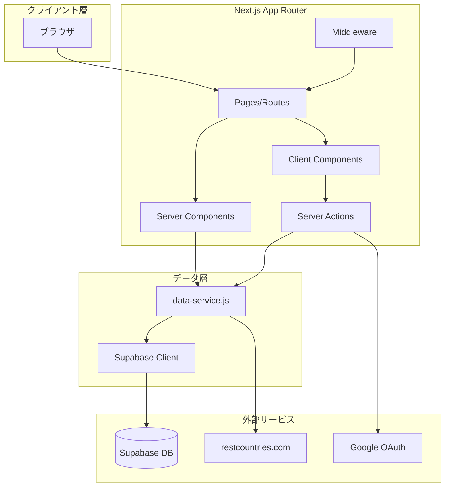

### リクエストフロー図

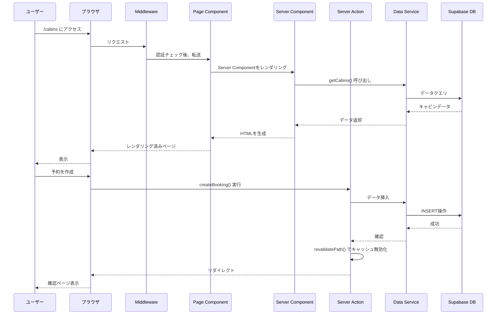

## 主要機能システム

アプリケーションは3つの主要な機能ドメインに分かれています。

### 1. キャビン管理システム

キャビンデータの表示と空室確認を処理します。

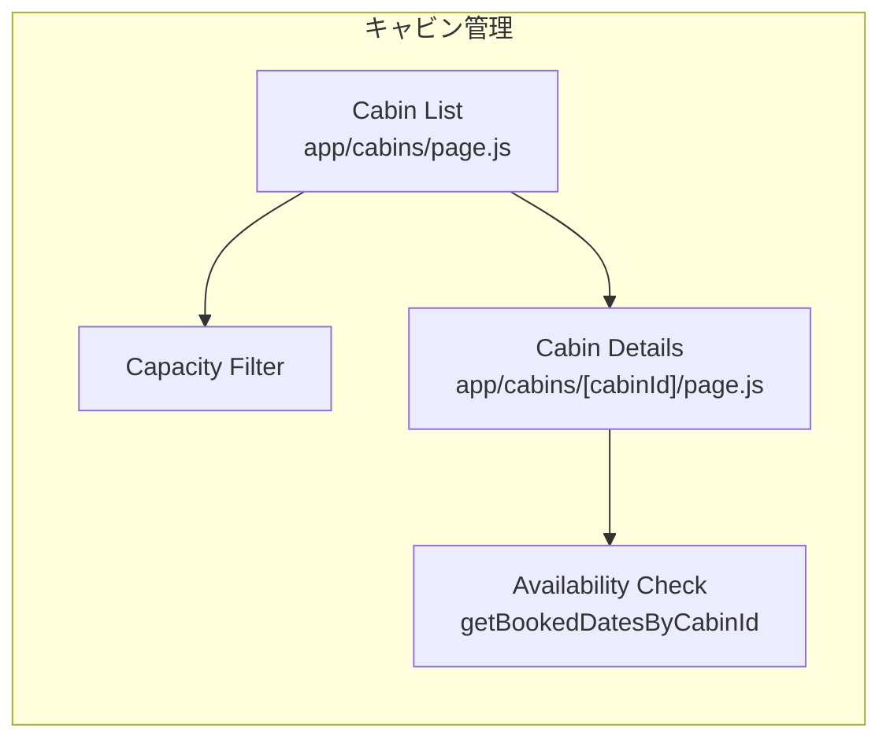

**主要コンポーネント:**
- **Cabin List**: `app/cabins/page.js` で収容人数フィルタリング機能付きのサーバーレンダリングされたキャビンカード
- **Cabin Details**: `app/cabins/[cabinId]/page.js` で静的生成された個別キャビンページ
- **Availability**: `data-service.js` の `getBookedDatesByCabinId()` を通じた日付ベースの空室クエリ

詳細なドキュメントは **Cabin Management System** を参照してください。

### 2. 予約・ブッキングシステム

日付選択から確認までの予約フローを管理します。

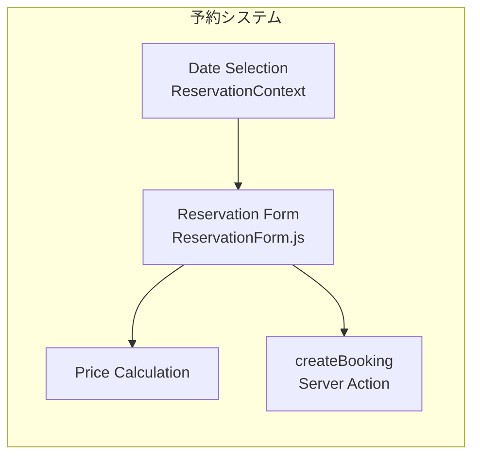

**主要コンポーネント:**
- **Date Selection**: `app/_components/ReservationContext.js` の ReservationContext を使用したインタラクティブカレンダー
- **Reservation Form**: 価格計算機能付きの `app/_components/ReservationForm.js` による予約作成
- **Server Actions**: データミューテーションのための `app/_lib/actions.js` の `createBooking()` アクション

詳細なドキュメントは **Reservation & Booking System** を参照してください。

### 3. アカウント管理

認証済みユーザー機能を提供します。

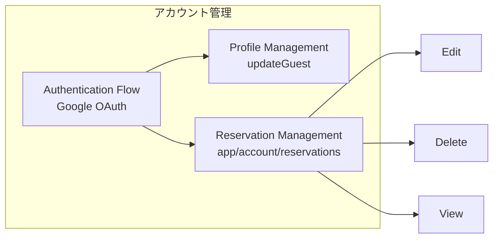

**主要機能:**
- **Profile Management**: `updateGuest()` サーバーアクションによるゲストプロフィール更新
- **Reservation Management**: `app/account/reservations/` を通じた予約の表示、編集、削除
- **Authentication Flow**: `signInAction()` と `signOutAction()` によるGoogle OAuthログイン/ログアウト

詳細なドキュメントは **Account Management** を参照してください。

## ファイル構造

コードベースはNext.js App Routerの規約に従い、機能ベースの構成になっています。

```
the-wild-oasis-website/
├── app/
│   ├── layout.js                    # ReservationProviderを含むルートレイアウト
│   ├── page.js                      # ホームページ (/)
│   ├── error.js                     # グローバルエラーバウンダリ
│   ├── not-found.js                 # 404ページ
│   │
│   ├── _components/                 # 共有コンポーネント
│   │   ├── Header.js                # ナビゲーション付きアプリヘッダー
│   │   ├── Navigation.js            # メインナビゲーションメニュー
│   │   ├── ReservationProvider.js   # 予約状態コンテキスト
│   │   ├── Spinner.js               # ローディングスピナー
│   │   └── ...                      # その他の共有コンポーネント
│   │
│   ├── _lib/                        # ライブラリコード
│   │   ├── actions.js               # サーバーアクション
│   │   ├── auth.js                  # NextAuth設定
│   │   ├── data-service.js          # Supabaseデータ層
│   │   └── supabase.js              # Supabaseクライアント設定
│   │
│   ├── cabins/                      # キャビンルート
│   │   ├── page.js                  # キャビン一覧 (/cabins)
│   │   ├── [cabinId]/               # 動的キャビン詳細
│   │   │   └── page.js              # 個別キャビンページ
│   │   └── thankyou/                # 予約後の確認ページ
│   │
│   ├── account/                     # アカウントルート (保護)
│   │   ├── layout.js                # サイドナビ付きアカウントレイアウト
│   │   ├── page.js                  # アカウントダッシュボード
│   │   ├── profile/                 # プロフィール管理
│   │   │   └── page.js              # プロフィール編集フォーム
│   │   └── reservations/            # 予約管理
│   │       ├── page.js              # 予約一覧
│   │       └── edit/[bookingId]/    # 予約編集
│   │
│   ├── about/                       # Aboutページ
│   │   └── page.js
│   │
│   ├── login/                       # ログインページ
│   │   └── page.js
│   │
│   └── api/                         # APIルート
│       └── auth/[...nextauth]/      # NextAuth APIエンドポイント
│
├── middleware.js                    # ルート保護ミドルウェア
├── public/                          # 静的アセット
├── package.json                     # 依存関係とスクリプト
├── next.config.js                   # Next.js設定
├── tailwind.config.js               # Tailwind CSS設定
├── jsconfig.json                    # JavaScriptコンパイラオプション
└── .eslintrc.json                   # ESLint設定
```

## 設定ファイル

### パスエイリアス

`jsconfig.json` で設定されたパスエイリアス:

```json
{
  "compilerOptions": {
    "paths": {
      "@/*": ["./*"]
    }
  }
}
```

これにより、以下のようなインポートが可能になります:
```javascript
import { auth } from "@/app/_lib/auth"
```

### ESLint設定

コード品質とパフォーマンスチェックのためにNext.jsコアウェブバイタルルールを拡張しています。

```json
{
  "extends": "next/core-web-vitals"
}
```

### ルートレイアウト設定

`app/layout.js` ファイルでグローバルアプリケーション設定を定義:

- **Title Template**: `%s | The Wild Oasis` で一貫したページタイトル
- **Description**: 高級キャビン市場をターゲットにしたSEOメタデータ
- **Font**: Google FontsのJosefin Sans
- **Provider**: 予約状態管理のために ReservationProvider でアプリケーションをラップ

## 統合ポイント

### 外部サービス統合

アプリケーションは複数の外部サービスと統合されています。

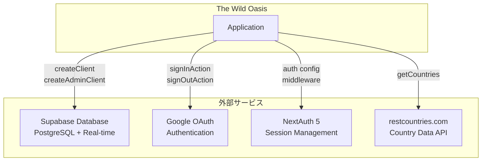

#### 1. Supabase Database

- **Client**: `app/_lib/supabase.js` の `createClient()` で作成
- **Admin Client**: 特権操作用の `createAdminClient()` で作成
- **目的**: キャビン、予約、ゲスト、設定用のPostgreSQLデータベース
- **Real-time**: ライブデータ更新のためのサブスクリプション機能

#### 2. Google OAuth

- **Provider**: `app/_lib/auth.js` でNextAuthを通じて設定
- **目的**: ユーザー認証とプロフィールデータ取得
- **Flow**: `signInAction()` と `signOutAction()` サーバーアクションで管理

#### 3. NextAuth 5

- **Configuration**: `app/_lib/auth.js` で定義
- **Session Management**: ルート保護のための `middleware.js` のミドルウェア
- **Callbacks**: ユーザーとセッション処理のためのカスタムコールバック

#### 4. restcountries.com API

- **Endpoint**: `https://restcountries.com/v2/all`
- **目的**: プロフィール管理用の国データ取得
- **実装**: `data-service.js` の `getCountries()` 関数で呼び出し

### 内部統合パターン

#### ReservationContext

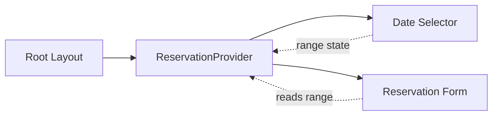

- **File**: `app/_components/ReservationContext.js`
- **目的**: 予約日付範囲のクライアントサイド状態管理
- **使用方法**: ルートレイアウトでラップされ、日付セレクターと予約フォームで使用
- **State**: `range` (開始/終了日) と `resetRange()` 関数

#### Server Actions キャッシュ無効化

- **パターン**: ミューテーション後の `revalidatePath()` 呼び出し
- **場所**: `app/_lib/actions.js` 全体
- **目的**: 更新後にUIが最新データを反映することを保証

## データフローアーキテクチャ

### 予約作成フロー

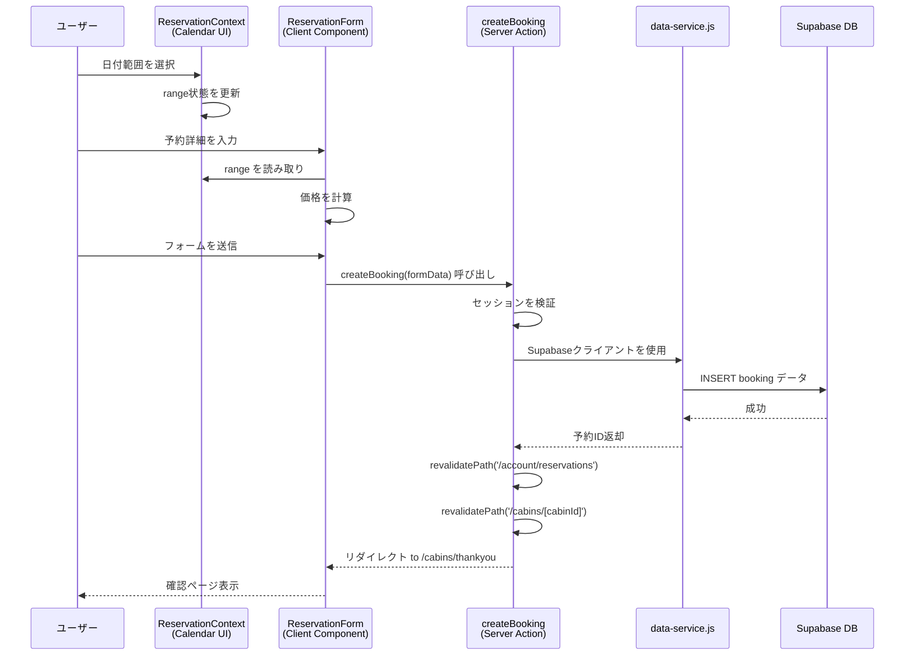

### 認証フロー

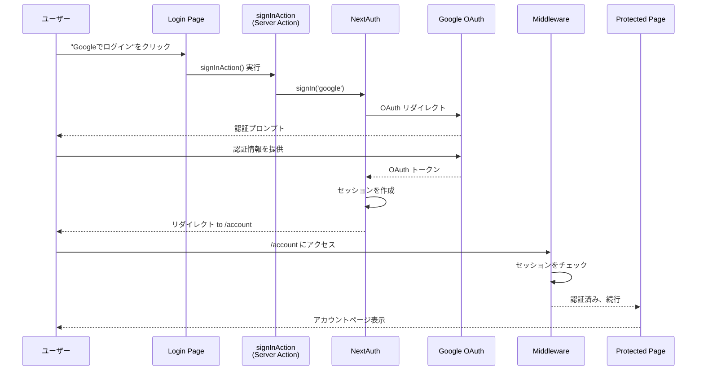

## パフォーマンス最適化

アプリケーションはいくつかのNext.jsパフォーマンス機能を活用しています。

### 1. 静的サイト生成 (SSG)

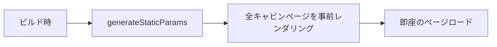

- **Cabin Pages**: `generateStaticParams()` でビルド時にキャビン詳細ページを事前生成
- **利点**: すべてのキャビンページの即座のページロード

### 2. インクリメンタル静的再生成 (ISR)

```javascript
// app/cabins/page.js
export const revalidate = 3600; // 1時間ごとに再検証
```

- **パターン**: ページコンポーネントでの `revalidate` エクスポート
- **使用法**: キャビン一覧と詳細ページがスケジュールに従って更新
- **利点**: 新鮮なデータを保ちながら静的パフォーマンス

### 3. Server Components

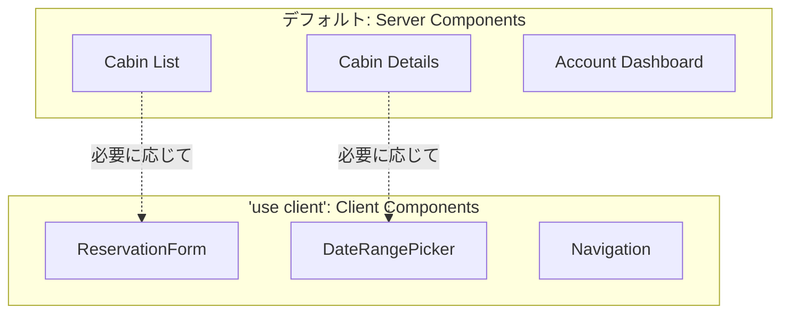

- **デフォルト**: 'use client' でマークされていない限り、すべてのコンポーネントはサーバーコンポーネント
- **利点**: JavaScriptバンドルサイズの削減、初期ページロードの改善

### 4. 画像最適化

- **Component**: Next.js Imageコンポーネントを全体で使用
- **利点**: 自動画像最適化、遅延読み込み、適切なサイジング

## 開発ワークフロー

### 利用可能なコマンド

```bash
# ホットリロード付き開発サーバー
npm run dev

# 本番ビルドを作成
npm run build

# 本番サーバーを実行
npm start

# リントチェックを実行
npm run lint

# ビルドして本番を開始 (組み合わせ)
npm run prod
```

### 環境要件

- **Node.js**: >=20.19.0 <21
- **環境変数**: 必要 (Project Setup & Configuration を参照)

### NPMスクリプト一覧

| スクリプト | コマンド | 目的 |
|----------|---------|------|
| dev | next dev | 開発サーバーを起動 |
| build | next build | 本番ビルドを作成 |
| start | next start | 本番サーバーを実行 |
| lint | next lint | ESLintチェックを実行 |
| prod | next build && next start | ビルドして本番を開始 |

## まとめ

The Wild Oasisは、包括的なキャビン予約体験を提供する最新のNext.js 14アプリケーションです。

### 主要なアーキテクチャ決定

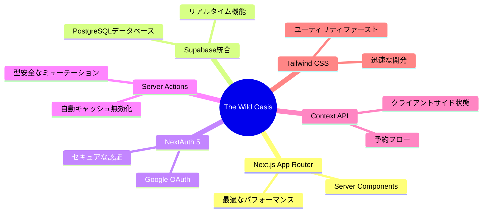

### システム構成

アプリケーションは3つのコア機能システム（キャビン管理、予約システム、アカウント管理）に編成され、明確な関心の分離とサービス指向のデータアクセス層を持っています。

### 技術的ハイライト

- ✅ **Next.js 14 App Router**: 最新のルーティングとレンダリング戦略
- ✅ **Server Components First**: デフォルトでサーバーレンダリング
- ✅ **Type-Safe Mutations**: Server Actionsによる型安全な操作
- ✅ **Real-time Capabilities**: Supabaseのリアルタイム機能
- ✅ **Performance Optimized**: SSG、ISR、画像最適化
- ✅ **Modern Authentication**: NextAuth 5 + Google OAuth
- ✅ **Developer Experience**: Tailwind CSS、ESLint、明確な構造

---

**注意**: このドキュメントは概要を提供します。各サブシステムの詳細な実装については、関連する専門ドキュメントを参照してください。
