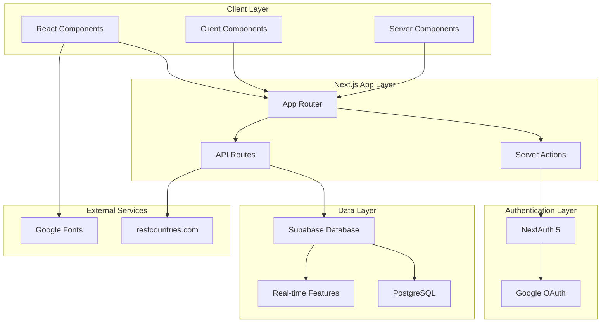
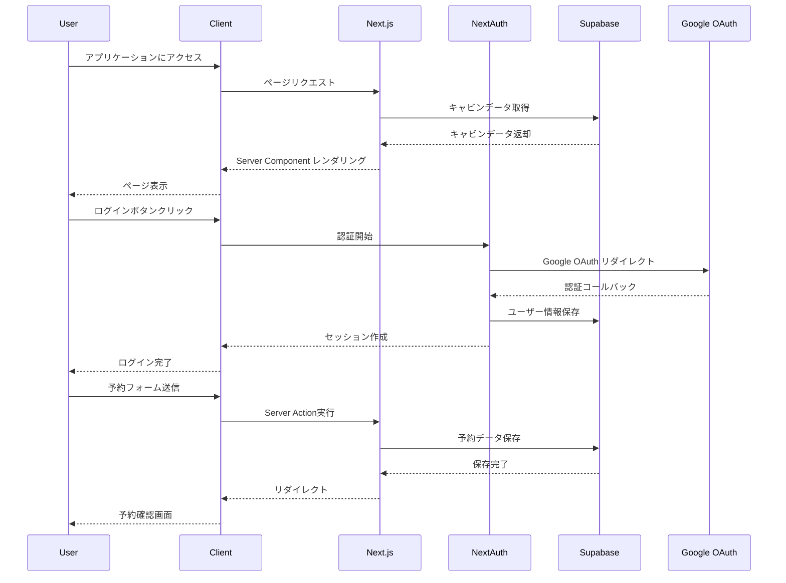

# The Wild Oasis キャビン予約アプリケーション

## 概要

この文書は、高級キャビン宿泊施設の予約を行うモダンなNext.jsウェブアプリケーション「The Wild Oasis」の包括的な概要を提供します。このシステムでは、ゲストが利用可能なキャビンを閲覧し、予約を行い、統合されたアカウント管理システムを通じて予約を管理できます。

この概要では、アプリケーションのアーキテクチャ、技術スタック、コア機能システムについて説明します。特定のサブシステムの詳細な実装については、**認証システム**、**予約システム**、**アカウント管理**を参照してください。

### 関連ソースファイル
- `app/layout.js (1-39行目)`
- `app/page.js (1-31行目)`
- `app/_components/Header.js (1-15行目)`
- `package.json (12-27行目)`

## アプリケーションの目的

The Wild Oasisは以下の機能を提供するキャビンホテル予約システムです：

- キャビンの閲覧・フィルタリング機能
- 日付ベースの空室確認と予約予約
- Google OAuthベースのユーザー認証
- プロフィール編集と予約管理を含むアカウント管理
- データの永続化とストレージのためのSupabaseとの統合

## システムアーキテクチャ概要

アプリケーションは、サーバーサイドレンダリングと選択的クライアントサイドインタラクティビティを持つモダンなNext.js 14 App Routerアーキテクチャに従います。

### 高レベルアーキテクチャ



## 技術スタック

アプリケーションは、パフォーマンスと開発者体験に最適化されたモダンなウェブ開発技術を活用しています。

| カテゴリ | 技術 | 目的 |
|---------|------|------|
| フロントエンドフレームワーク | Next.js 14 | App Router、Server Components、Server Actions |
| UIライブラリ | React 18 | SSRサポートによるコンポーネントベースUI |
| 認証 | NextAuth 5 | OAuth統合とセッション管理 |
| データベース | Supabase | リアルタイム機能を持つPostgreSQLデータベース |
| スタイリング | Tailwind CSS | ユーティリティファーストCSSフレームワーク |
| アイコン | Heroicons | Reactアイコンライブラリ |
| 日付処理 | date-fns, react-day-picker | 日付操作とカレンダーUI |
| フォント | Josefin Sans | Google Fonts統合 |

## コア機能エリア

アプリケーションは3つの主要機能ドメインに整理されています：

### キャビン管理システム

- **キャビン閲覧**: フィルタリング機能付きサーバーレンダリングキャビンリスト
- **キャビン詳細**: 画像ギャラリーとアメニティを含む個別キャビンページ
- **空室確認**: 日付ベースのキャビン空室照会

### 予約システム

- **日付選択**: チェックイン/チェックアウト日のインタラクティブカレンダー
- **予約フォーム**: ゲスト情報キャプチャと予約作成
- **状態管理**: コンポーネント間の日付状態のための`ReservationContext`

### アカウント管理

- **プロフィール管理**: 国選択機能付きゲストプロフィール編集
- **予約管理**: 既存予約の表示、編集、キャンセル
- **認証フロー**: Google OAuthログイン/ログアウト機能

## アプリケーションファイル構造

コードベースは、機能ベースの組織化を伴うNext.js App Router規約に従います。

### ファイル構造図

```
the-wild-oasis/
├── app/
│   ├── layout.js              # アプリケーションのルートレイアウト
│   ├── page.js                # ホームページ
│   ├── _components/           # 共有コンポーネント
│   │   ├── Header.js          # アプリケーションヘッダー
│   │   ├── Navigation.js      # ナビゲーションコンポーネント
│   │   └── ReservationProvider.js # 予約状態管理
│   ├── cabins/                # キャビン関連ページ
│   │   ├── page.js            # キャビン一覧
│   │   └── [cabinId]/         # 動的キャビン詳細
│   ├── reservations/          # 予約関連ページ
│   │   ├── page.js            # 予約一覧
│   │   └── [reservationId]/   # 個別予約管理
│   ├── account/               # アカウント管理
│   │   ├── page.js            # プロフィール
│   │   └── profile/           # プロフィール編集
│   └── api/                   # APIルート
│       └── auth/              # 認証関連API
├── lib/                       # ユーティリティ関数
│   ├── supabase.js            # Supabaseクライアント
│   ├── auth.js                # 認証設定
│   └── utils.js               # ヘルパー関数
├── public/                    # 静的ファイル
├── package.json               # プロジェクト設定
└── next.config.js             # Next.js設定
```

## 主要設定要素

アプリケーションのメタデータとグローバル設定は、ルートレイアウトで定義されています：

- **アプリケーションタイトルテンプレート**: 一貫したページタイトルのための`%s | The Wild Oasis`
- **SEO説明**: イタリアドロミテの高級キャビンホテル市場をターゲット
- **グローバルスタイリング**: Tailwind CSSユーティリティクラスとJosefin Sansフォント
- **レイアウト構造**: ReservationProviderコンテキストを含むヘッダー + メインコンテンツエリア

## 統合ポイント

システムは複数の外部サービスと内部モジュールと統合されています：

### 外部統合
- **Supabase**: データベース操作、ファイルストレージ、リアルタイムサブスクリプション
- **Google OAuth**: ユーザー認証とプロフィールデータ
- **NextAuth**: セッション管理と認証ミドルウェア
- **restcountries.com**: プロフィール管理用の国データ

### 内部統合
- **ReservationContext**: 予約フローコーディネーションのためのクライアントサイド状態

## システムフロー図



このアーキテクチャにより、モダンな開発プラクティスとユーザーエクスペリエンスパターンを備えたスケーラブルで高性能なキャビン予約システムが実現されています。

## まとめ

The Wild Oasisは、Next.js 14のApp Routerを活用した現代的なウェブアプリケーションであり、高級キャビン予約体験を提供します。Supabaseとの統合により堅牢なデータ管理を実現し、Google OAuthによる認証システムでセキュアなユーザー体験を提供しています。

この技術スタックの組み合わせにより、パフォーマンス、スケーラビリティ、開発者体験の全てにおいて優れたソリューションを実現しています。
